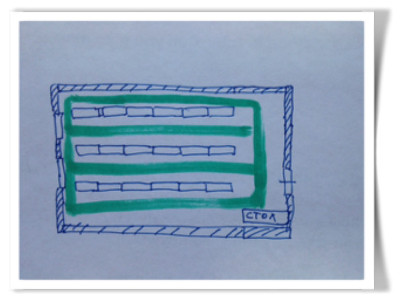

# Задачи на собеседованиях

1. **Тыры-пыры, она же foo-bar**. Напишите программу, которая выводит на экран числа от 1 до 100. При этом вместо чисел, кратных 3, программа должна выводить слово «Hi», а вместо чисел, кратных 5 — слово «By». Если число кратно и 3, и 5, то программа должна выводить слово «HiBy».
1. Имеется строка набранная в разном регистре, например: «ВотТакаяСтрока» требуется получить в результате строку где буквы меняют регистр, то есть: «вОТтАКАЯсТРОКА». Напишите, пожалуйста, код.
1. Дана строка `s` и словарь `dict` , содержащий некие слова. Определите, можно ли строку `s` сегментировать в последовательность разделенных пробелом слов, содержащихся в словаре `dict`.

    Пример: дано, `s` = «двадесятка», `dict` = [«два», «десятка», «девятка»]. Программа должна вернуть `true`, потому что «двадесятка» могут быть сементированы как «два десятка».

1. Найдите непрерывный подмассив в массиве (содержащем как минимум 1 элемент), который имеет максимальную сумму элементов.

    Пример: [-1, -13, -2, 1, -3, 4, -1, 2, 1, -5, 4] должно вернуть [4, -1, 2, 1].

1. Дан треугольник. Найдите минимальный путь от вершины до основания. На каждом шаге вы можете двигаться только на соседние цифры, находящиеся в ряду ниже.

    Пример:

    ```
    [
         [2],
        [3,4],
       [6,5,7],
      [4,1,8,3]
    ]
    ```

    Здесь длина минимального пути от вершины до основания равна 11 (т.к 2+3+5+1 = 11).

1. У компании имеется следующий склад (см. рис), три ряда стеллажей, стоящие в ряд по 700 ед. Каждый стеллаж содержит 5 полок. Каждая полка содержит 6 ячеек. Между рядами стеллажей есть проходы. Между стеллажами в одном ряду проходов нет. Ширина полок одинакова и равна ширине прохода. Зеленым цветом обозначены проходы.

    Кладовщику выдается случайный перечень ячеек, из которых требуется взять товар. Помогите составить маршрут передвижения кладовщика по складу, начиная движение от стола, таким образом, чтобы он затратил минимально возможный путь.

    1. Достаточно описать шаги алгоритма решения задачи.
    1. Объясните почему решение оптимальное.

        

1. Найдите минимальную разницу в минутах между двумя моментами времени из списка.

    Например, если массив такой `["2:10pm", "1:30pm", "10:30am", "4:42pm"]`, программа должна вернуть 40, потому что минимальная разница — между 1:30pm и 2:10pmи она равна 40 минутам.

    На вход всегда передается массив из как минимум двух элементов, все элементы массива заданы в корректном формате и уникальны.
